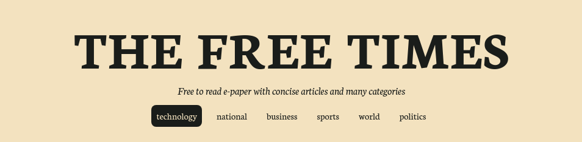

# THE FREE TIMES

 

# About
The free times is a free-to-read e-paper with concise articles and many categories. My aim is to provide a nice newspaper like experience to the user. Articles are arranged in a 3-column layout, and the page is responsive in nature.
 
 

 
This project is open to contributions. Feel free to add anything useful.
